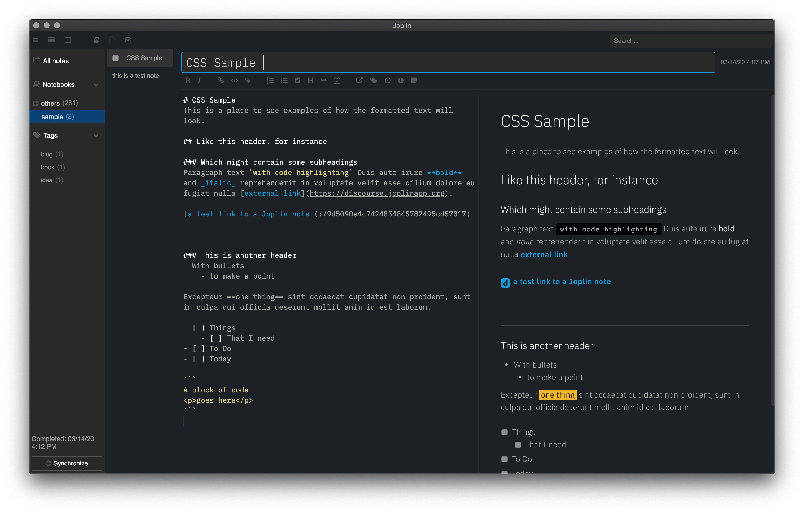
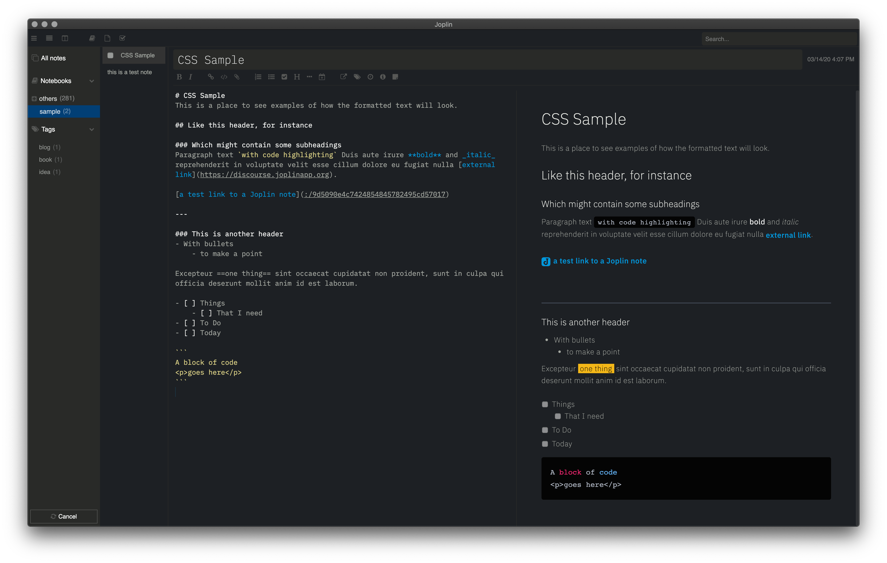

# joplin-theme

This repo houses my Joplin theme. Joplin is an open source note taking app.
Learn more about [Joplin](http://joplinapp.org).

## Screenshots
Here it is at normal zoom.


Here's a zoomed out view.


## To use
1. From the Joplin app, navigate to Joplin > Preferences > Appearances

2. Under the Advanced Settings button:
    - Edit `Custom stylesheet for rendered Markdown` and paste the content from `userstyle.css`
    - Edit `Custom stylesheet for Joplin-wide app styles` and paste the content from `userchrome.css`

3. Install fonts on your computer

This theme assumes you have IBM Plex Sans and Mono installed on your machine. Install those from https://github.com/IBM/plex or change the following lines in both css files to your favorite font:
```
--font-sans: "IBM Plex Sans";
--font-mono: "IBM Plex Mono";
```

4. Things looking weird?
- Make sure to select the "Dark" Theme in Joplin > Preferences > Appearances
- Editor font size is set to 14

## Want to tweak?
At the top of both files you can see that many things are defined as css variables. That might be a good place to start to see how the theme is built.

I prefer navigating to `~/.config/joplin-desktop` and editing the two files directly.

The changes won't apply until you close and reopen the app. Or you are using Dev Tools to mess with CSS (Help > Toggle Developer tools), you can hit Command-R (Mac) to Force Reload the app to apply the CSS without having to quit.

## Want to get rid of this theme?
Delete everything out of the 2 CSS files and you will be back to normal.

## Want to see more themes and talk about Joplin CSS? 
Visit https://discourse.joplinapp.org/t/share-your-css/1730/56
